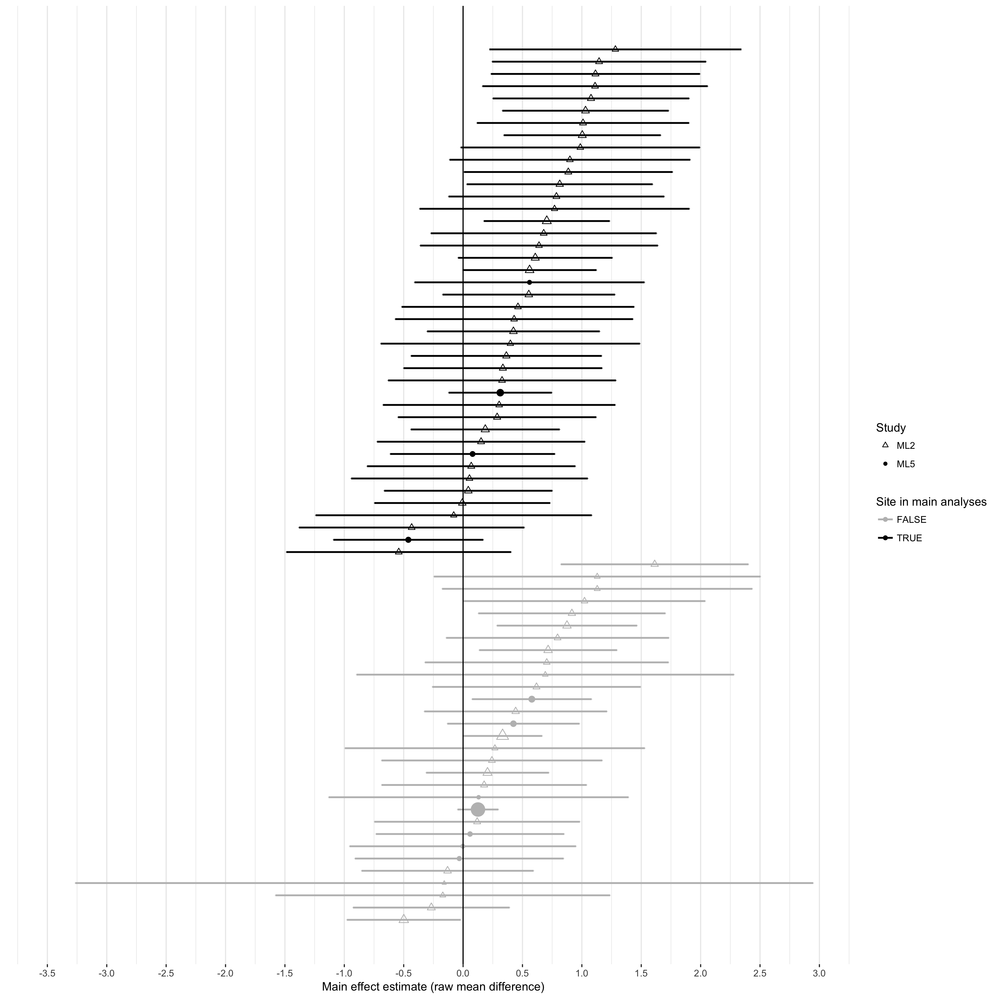

```{r, echo=FALSE, message=FALSE, warning=FALSE, cache=FALSE}
# "opts_chunk not found" error: put library(knitr) right before setting chunk opts

# load all packages with no annoying warnings
library(tidyverse)
library(papaja)
library(knitr)
library(lme4)
library(stargazer)
library(metafor)
library(rmeta)
library(lmerTest)
library(Replicate)

rm( list = ls() )

# Option 1: re-run analyses and re-create plots
# source("helper.R")
# source("analysis.R")

# Option 2: use saved output from previous analysis run
# load( "analysis_objects.rds" )
setwd("~/Dropbox/Personal computer/Independent studies/Many Labs 5 (ML5)/ML5_risen_gilovich/compare_to_ml2")
load( "ml2_comparison_objects.rds" )

opts_chunk$set(cache=FALSE)
```


# Questionnaire differences 

We identified three minor differences in the design of the questionnaire that might have contributed to the discrepant results (Table 1, rows 1-3). First, the endpoints of the scale measuring perceived likelihood ranged from 1-10 in ML2 but ranged from 0-10 in ML5 and in the original study. Second, the questionnaire permitted subjects to skip questions in ML2, but not in ML5, potentially leading to systematic differences in characteristics of self-selected subjects; the original study was conducted on paper, so likely did not prevent subjects from skipping questions. Third, in ML2, the questionnaire was embedded in a roughly 30-minute series of experiments presented in a randomized order, which was not the case in ML5. 

To investigate whether these differences in questionnaire design might have contributed to the discrepant results, we compared results between each study's sample of Amazon Mechanical Turk subjects in the United States. To the extent that these samples are directly comparable, any effects of the different questionnaire designs would likely produce differences in results between the MTurk samples. In contrast, the two samples estimated nearly identical point estimates (raw mean difference = `r round( ml2.turk.est, 2 )`, n = `r ml2.turk.n` in ML2 vs. `r round( ml5.turk.est, 2 )`, n = `r ml5.turk.n` in ML5)^[Of course, statistical inference on these point estimates differed due to the difference in sample sizes.]. Additionally, the extent of missing data was negligible in ML2 (`r perc.missing.ml2`%), and their analyses of possible order effects suggested \textbf{XXX.} 


# Analysis differences

Additionally, the two studies used slightly different statistical analyses to aggregate data across sites: ML2 used an independent-samples t-test allowing for heteroskedasticity, while ML5 used a linear mixed model with model-based standard errors that assumed homoskedasticity. The original study used a one-way ANOVA (which assumes homoskedasticity). We therefore reanalyzed all subject-level data for primary analysis sites in both studies using identical statistical analyses using three approaches^[Each of these models is saturated, so is unbiased for the point estimate; thus, differences would emerge primarily in statistical inference.]:

\begin{enumerate}
\item To reproduce the analysis approach in ML5, we used a linear mixed model (\textbf{LMM}) to regress perceived likelihood on fixed effects of tempting fate, the interaction of tempting fate with study (ML5 vs. ML2), exchangeable random intercepts and slopes by site, and with normal errors. Inference used model-based standard errors, so assumed homoskedasticity.
\item To avoid parametric assumptions\footnote{Although GEE is in general semiparametric rather than nonparametric, here the model is saturated due to the categorical predictors, so is effectively nonparametric.}, we used generalized estimating equations (\textbf{GEE}) with a working independent correlation structure to regress perceived likelihood on tempting fate. Inference used robust standard errors, so made no assumptions about how subjects were correlated within sites or otherwise.
\item{ To reproduce the analysis approach in ML2, we computed raw mean differences (\textbf{RMD}) between tempting-fate conditions for each study separately, ignoring correlation of subjects within sites. We estimated standard errors for each as in the independent-samples Welch $t$-test conducted for ML2. We then tested the null hypothesis that the RMDs reflected the same population difference in both studies using the fact that, under the null: 
$$\frac{ \widehat{\Delta}_{ML2} - \widehat{\Delta}_{ML5}}{ \sqrt{ \widehat{SE}^2_{\widehat{\Delta}_{ML2}} + \widehat{SE}^2_{\widehat{\Delta}_{ML5}} } } \approx N(0,1)$$
where $\widehat{\Delta}_{ML2}$ and $\widehat{\Delta}_{ML5}$ denote the estimated RMDs in ML2 and ML5 respectively.
}
\end{enumerate}

All three approaches yielded strong evidence for persistent discrepancies between the studies (Table XXX).


```{r, echo=FALSE, results="asis"}
kable( sim.table, 
       col.names = c("Method",
                        "Allows correlation within sites",
                        "Assumes homoskedasticity",
                        "Estimate",
                        "95\\% CI",
                        "p-value"),
caption = "Difference between ML5 and ML2 in average main effect estimates (as raw mean differences) in primary analysis sites under varying statistical assumptions"
)
# apa_table(sim.table, 
#           col.names = c("Method",
#                         "Allows correlation within sites?",
#                         "Assumes homoskedasticity?",
#                         "Estimate",
#                         "95\\% CI",
#                         "p-value"),
#           caption = "Table 3: In units of perceived likelihood on a 0-10 scale, estimates of the main effect and focus interaction effect in similar university sites and under the RPP protocol (MTurk), as well as estimates of the difference between these estimates. Total n = 3727.")
```

# Sampling frame differences

The most conspicuous protocol difference involved the sampling frame used in primary analyses: ML2 analyzed undergraduates at a variety of colleges and universities in the United States and abroad, while ML2 analyzed undergraduates at similar sites. We speculated that results might align more closely if we constructed more directly comparable sampling frames, so we redid all three analyses above (LMM, GEE, and RMD), but expanding the sampling frame to all sites that collected data for each study. Thus, the expanded sampling frames for both ML2 and ML5 included subjects collected in one or more online samples, undergraduates at a small number of universities that would be classified as "similar" by ML5, and undergraduates at a larger number of domestic or foreign universities that would be classified as "dissimilar" by ML5.

```{r, echo=FALSE, results="asis"}
kable( all.table, 
       col.names = c("Method",
                        "Allows correlation within sites",
                        "Assumes homoskedasticity",
                        "Estimate",
                        "95\\% CI",
                        "p-value"),
caption = "Difference between ML5 and ML2 in average main effect estimates (as raw mean differences) in all sites under varying statistical assumptions"
)

# apa_table(sim.table, 
#           col.names = c("Method",
#                         "Allows correlation within sites?",
#                         "Assumes homoskedasticity?",
#                         "Estimate",
#                         "95\\% CI",
#                         "p-value"),
#           caption = "Table 3: In units of perceived likelihood on a 0-10 scale, estimates of the main effect and focus interaction effect in similar university sites and under the RPP protocol (MTurk), as well as estimates of the difference between these estimates. Total n = 3727.")
```

<!-- PUT P-VALS IN TABLES IN SCI NOTATION -->

Lastly, we investigated whether outlying sites might have strongly influenced results in one or both studies. These outliers could arise, for example, from idiosyncrasies of protocol administration, subject characteristics, or errors in data collection or analysis. From a visual inspection of the forest plots (Figure 1), none of the primary analysis sites in either study appeared to be an outlier. Among all sites, Eotvos Lorand University (in ML5) may have been a modest outlier, but because this site estimated a large positive effect, its presence would, if anything, have reduced rather than exacerbated the discrepancy between studies. Outlying sites therefore do not appear to account for the discrepancy.




# A combined estimate of tempting-fate effects

We combined all data from both studies to arrive at an updated estimate of the average effect of tempting fate across the diverse samples included in both studies. We again fit LMM and GEE models to primary analysis sites from both studies, omitting the interaction of tempting fate with study to estimate an average effect. The LMM model estimated a tempting-fate effect of `r round( lmm_output(lmm4, "tempt")$est, 2 )` on the raw mean difference scale (95% CI: [`r round( lmm_output(lmm4, "tempt")$lo, 2 )`, `r round( lmm_output(lmm4, "tempt")$hi, 2 )`]; $p$ = `r round( 10^12 * lmm_output(lmm4, "tempt")$pval, 0 )` $\times 10^{-12}$). As expected, the GEE yielded a similar estimate (`r round( gee_output(gee4, "tempt")$est, 2 )`) with more conservative inference (95% CI: [`r round( gee_output(gee4, "tempt")$lo, 2 )`, `r round( gee_output(gee4, "tempt")$hi, 2 )`]; $p$ = `r round( 10^10 * gee_output(gee4, "tempt")$pval, 0 )` $\times 10^{-10}$). The naïve Cohen's $d$ effect size was an estimated `r abs( round( d.sim$est, 2) )` (95% CI `r abs( round( d.sim$conf.int[1], 2 ) )`, `r abs( round( d.sim$conf.int[2], 2 ) )`). To assess consistency between this pooled estimate and the estimate of the original study, we estimated that, if the original study were consistent with all replications, then the probability of observing a point estimate in the original study at least as extreme as that actually observed would be approximately $P_{orig}=$ `r my_round(p.orig.agg.all,2)` \textbf{(CITE)}. This method assumes normally distributed true effects, which appeared reasonable here, and accounts for the observed heterogeneity across sites.

Alternatively, including all sites that collected data for either study had little effect on point estimates or inference. The LMM model estimated a tempting-fate effect of `r round( lmm_output(lmm2, "tempt")$est, 2 )` on the raw mean difference scale (95% CI: [`r round( lmm_output(lmm2, "tempt")$lo, 2 )`, `r round( lmm_output(lmm2, "tempt")$hi, 2 )`]; $p$ = `r round( 10^13 * lmm_output(lmm2, "tempt")$pval, 0 )` $\times 10^{-13}$). The GEE yielded a similar estimate (`r round( gee_output(gee2, "tempt")$est, 2 )`) but with more conservative inference (95% CI: [`r round( gee_output(gee2, "tempt")$lo, 2 )`, `r round( gee_output(gee2, "tempt")$hi, 2 )`]; $p$ = `r round( 10^6 * gee_output(gee2, "tempt")$pval, 0 )` $\times 10^{-6}$). The naïve Cohen's $d$ effect size was an estimated `r abs( round( d.sim$est, 2) )` (95% CI `r abs( round( d.sim$conf.int[1], 2 ) )`, `r abs( round( d.sim$conf.int[2], 2 ) )`). As a metric of consistency with the original study, we estimated $P_{orig}=$ `r my_round(p.orig.agg.sim,2)`; however, this must be interpreted cautiously in light of possible departure from normality.

# Discussion

* Discuss combined point estimates and their inference
* Cohen's d estimates should be interpreted cautiously because blahblahblabh. 
* Point estimate much smaller than original but still consistent because of original's small sample size


