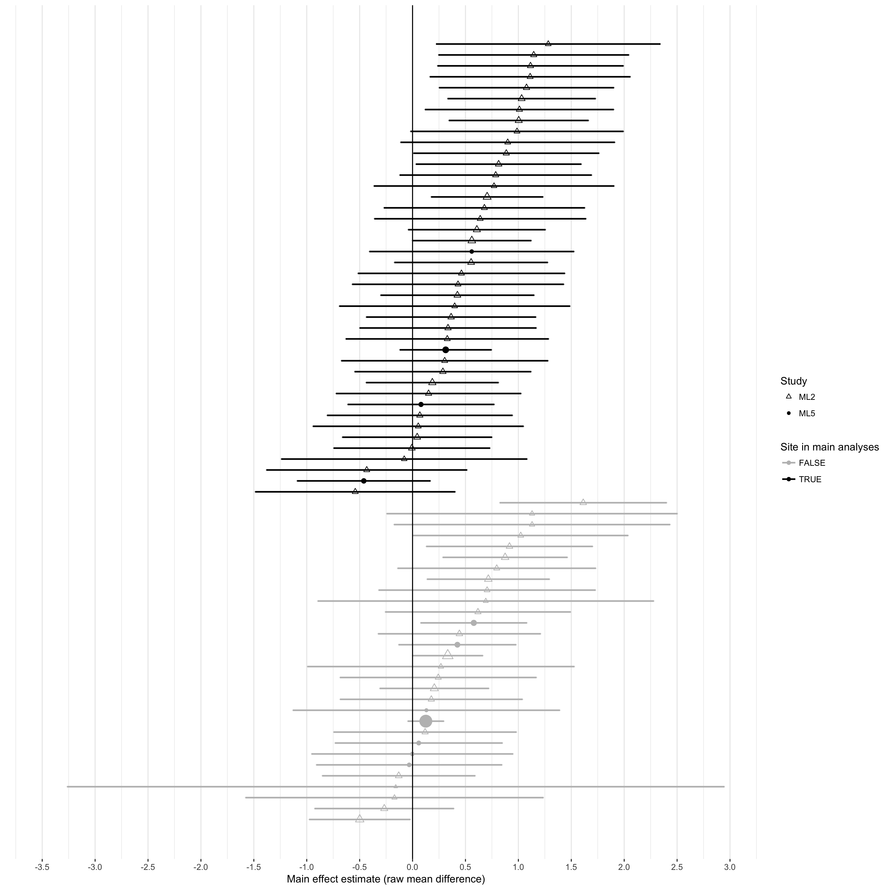

<!-- remove automatic table labels because Fig 1 is actually a table -->
\captionsetup[table]{labelformat=empty}
\captionsetup[figure]{labelformat=empty}

```{r echo=FALSE, message=FALSE, results='hide', warning=FALSE}
# load all packages
library(tidyverse)
library(papaja)
library(knitr)
library(lme4)
library(stargazer)
library(metafor)
library(rmeta)
library(lmerTest)
library(Replicate)

rm( list = ls() )

# Option 1: re-run analyses and re-create plots
# source("helper.R")
# source("analysis.R")

# Option 2: use saved output from previous analysis run
path.root = "~/Dropbox/Personal computer/Independent studies/Many Labs 5 (ML5)/ML5_risen_gilovich"
setwd(path.root)
load( "main_code/analysis_objects.rds" )

setwd("~/Dropbox/Personal computer/Independent studies/Many Labs 5 (ML5)/ML5_risen_gilovich/compare_to_ml2")
load( "ml2_comparison_objects.rds" )

opts_chunk$set(tidy.opts=list(width.cutoff=60),tidy=TRUE)
```

\tableofcontents
\newpage


# Descriptive Statistics and Plots

## Cohen's $d$ and $t$-tests within each site

Per the preregistration, here we conduct additional within-site analyses that reproduce the original study's stratified analyses and effect sizes of tempting fate. 


```{r, echo=FALSE, results='asis'}
temp = data.frame( sites$site, 
                   sites$d.no.load, 
                   sites$pval.no.load, 
                   sites$d.load, 
                   sites$pval.load )
  temp[ , -1 ] = round( temp[ , -1 ], 2 )

kable( temp, col.names = c("Site", 
                           "Cohen's d (no load)",
                           "p-value (no load)",
                           "Cohen's d (load)",
                           "p-value (load)"  ),
       caption = "Supplementary Table 1: Cohen's d and p-values for t-tests of the effect of tempting fate on perceived likelihood, stratified by cognitive load within each site.")
```

## Interaction plots by site type

Boxplots: medians and IQRs; lines: simple means by subset. These aggregated means and SDs pool across all sites within a group (similar, dissimilar, MTurk) and do not account for clustering by site.

```{r, echo=FALSE, fig.cap="asfdasdfasdfasdf"}
library(ggplot2)  # do not remove

##### Fn: Interaction Plot #####
# pass the desired subset of data
int_plot = function( dat, ggtitle ) {
    agg = dat %>%
      group_by(load, tempt) %>%
      summarise(val = mean(lkl, na.rm=TRUE))  # aggregate data for plotting happiness
    
  colors = c("black", "orange")
  plot( ggplot( dat, aes(x = as.factor(load), y = lkl, color=as.factor(tempt) ) ) + geom_boxplot(width=0.5) +
      geom_point(data = agg, aes(y = val), size=4 ) +
      geom_line(data = agg, aes(y = val, group = tempt), lwd=2 ) +
      scale_color_manual(values=colors) +
      scale_y_continuous( limits=c(0,10) ) +
      ggtitle(ggtitle) +
      theme_bw()  + xlab("Cognitive load?") + ylab("Perceived likelihood of being called on") +
      guides(color=guide_legend(title="Tempted fate?"))
    )
}

##### Plot By Subset #####
int_plot(b, ggtitle = "All sites (including MTurk)")  # all sites
int_plot(b[ b$group=="b.similar", ], ggtitle = "Similar sites")
int_plot(b[ b$group=="c.dissimilar", ], ggtitle = "Dissimilar sites")
int_plot(b[ b$group=="a.mturk", ], ggtitle = "Mechanical Turk")
```  


## Cell means and standard deviations by site type


```{r, echo=FALSE, results='asis'}
agg.means = aggregate( lkl ~ tempt + load + group, b, mean)
agg.sds = aggregate( lkl ~ tempt + load + group, b, sd)

agg = data.frame( cbind( agg.means, agg.sds$lkl) )
names(agg)[4:5] = c("mean", "SD")
agg[ , 4:5] = round( agg[ , 4:5], 2 )

kable( agg, caption = "Supplementary Table 2: Means and SDs of perceived likelihood across all subjects
           within each site type (naively pooling all sites)" )
``` 


# Statistical Consistency of Original Study with Replications

We conducted post hoc secondary analyses to assess the extent to which the replication findings were statistically consistent with the original study; that is, whether it is plausible that the original study was drawn from the same distribution as the replications [@mathur_rrr]. These analyses account for uncertainty in both the original study and the replication and for possible heterogeneity in the replications, and they can help distinguish whether an estimated effect size in the replications that appears to disagree with the original estimate may nevertheless be statistically consistent with the original study due, for example, to low power in the original study or in the replications or to heterogeneity.

We found that, if indeed the original study were statistically consistent with results from the similar sites in the sense of being drawn from the estimated distribution of the replications in similar sites, there would be a probability of $P_{orig}=$ `r round( p.orig.main.sim, 2 )` that the original main effect estimate would have been as extreme as or more extreme than the observed value of $b=$ `r yi.orig.main`. This probability is slightly higher (`r round( p.orig.main.uni, 2 )`) when considering the estimated distribution in all university sites. For the focus interaction, the probability of an original estimate at least as extreme as the observed $b=$ `r yi.orig.int` if the original study were statistically consistent with the similar-site replications is $P_{orig}=$ `r round( p.orig.int.sim, 2 )`; this probability is comparable (`r round( p.orig.int.uni, 2 )`) when considering the distribution of all university sites.


\pagebreak

# Sensitivity Analyses for Reported Results

## Fit subset model counterpart to primary analysis model

Instead of fitting a model that includes both MTurk and similar sites with an interaction of site type, we fit a model to only the subset of similar sites. 

```{r, echo=TRUE}
m1.temp = lmer( lkl ~ tempt * load + (tempt * load | site),
                data = b[ b$group == "b.similar", ] )
CI.temp = confint( m1.temp, method = "Wald" )
```

In the primary model, the estimated main effect was `r round( main.sim$est, 2)` with 95\% CI: (`r round( main.sim$lo, 2)`, `r round( main.sim$hi, 2)`), whereas in the present subset model, it is `r round( fixef(m1.temp)["tempt"], 2)` with 95\% CI: (`r round( CI.temp[row.names(CI.temp) == "tempt", 1], 2)`, `r my_round( CI.temp[row.names(CI.temp) == "tempt", 2], 2)`). Also, in the primary model, the estimated interaction effect was `r round( int.sim$est, 2)` with 95\% CI: (`r round( int.sim$lo, 2)`, `r round( int.sim$hi, 2)`), whereas in the present subset model, it is `r round( fixef(m1.temp)["tempt:load"], 2)` with 95\% CI: (`r round( CI.temp[row.names(CI.temp) == "tempt:load", 1], 2)`, `r round( CI.temp[row.names(CI.temp) == "tempt:load", 2], 2)`). These results are similar.


## Fit meta-analytic counterparts to primary analysis model


Instead of fitting a mixed model to observation-level data, we fit a random-effects meta-analysis to the point estimates using the Paule \& Mandel heterogeneity estimator and the Knapp-Hartung standard error adjustment. For the main effect:


```{r, message = FALSE, warning = FALSE}
meta.main = rma.uni( yi = site.main.est, vi = site.main.SE^2,
                     data=sites[ sites$group == "b.similar", ],
                     measure="MD", method="PM", knha = TRUE )

p.orig.main.2 = p_orig( orig.y = yi.orig.main, orig.vy = vyi.orig.main,
                      yr = meta.main$b, t2 = meta.main$tau2,
                      vyr = meta.main$vb )
```
In the above mixed model, the estimated main effect and heterogeneity in similar sites was $\widehat{M}=$ `r round( Mhat.main, 2 )` and $\widehat{V}=$ `r round( Vhat.main, 2 )` compared to $\widehat{M}=$ `r round( meta.main$b , 2 )` and $\widehat{V}=$ `r round( meta.main$tau2, 2 )` in the meta-analysis. They agree very closely. $P_{orig}$ is a bit lower (`r my_round(p.orig.main.2, 2)`) due to the lower estimated heterogeneity here. 

For the focus interaction effect:

```{r, message = FALSE, warning = FALSE}
meta.int = rma.uni( yi = site.int.est, vi = site.int.SE^2,
                     data=sites[ sites$group == "b.similar", ],
                     measure="MD", method="PM", knha = TRUE )

p.orig.int.2 = p_orig( orig.y = yi.orig.int, orig.vy = vyi.orig.int,
                      yr = meta.int$b, t2 = meta.int$tau2,
                      vyr = meta.int$vb )
```


In the above mixed model, the estimated interaction effect and heterogeneity in similar sites was $\widehat{M}=$ `r round( Mhat.int, 2 )` and $\widehat{V}=$ `r round( Vhat.int, 2 )` in the mixed model compared to $\widehat{M}=$ `r round( meta.int$b, 2 )` and $\widehat{V}=$ `r round( meta.int$tau2, 2 )` in the meta-analysis. $P_{orig}$ is again slightly lower (`r my_round(p.orig.int.2, 2)`). These results agree reasonably closely. 


## Combine all universities into one category

In the planned secondary analysis model including all universities, similar and dissimilar sites were treated as separate categories. Here, they are combined into one category. 

```{r, echo=FALSE}
######## For Supplement: Parameter Estimates from Uni vs. MTurk Model ######## 

name = c("Tempt main effect within MTurk", 
          "Tempt main effect within university sites",
          "Effect of university site vs. MTurk on tempt main effect", 
          "Tempt-load interaction within MTurk", 
          "Tempt-load interaction within university sites",
          "Effect of university site vs. MTurk on tempt-load interaction"
          )

# negative ones are when coefficient is ( MTurk - uni )
value = as.numeric( c( mturk.main.m2$est, 
           fixef(m2)["tempt"], 
           -fixef(m2)["tempt:is.mturk"],  
           mturk.int.m2$est, 
           fixef(m2)["tempt:load"], 
           -fixef(m2)["tempt:load:is.mturk"]
           ) )
value = my_round(value, 2)

# negative ones also use the second CI limit in order to 
#  report them as "lo, hi" instead of vice-versa
lo = as.numeric( c( mturk.main.m2$lo, 
           CI2[ row.names(CI2) == "tempt", 1 ], 
           -CI2[ row.names(CI2) == "tempt:is.mturk", 2 ],
           mturk.int.m2$lo, 
           CI2[ row.names(CI2) == "tempt:load", 1 ], 
           -CI2[ row.names(CI2) == "tempt:load:is.mturk", 2 ]
           ) )
lo = my_round(lo, 2)

hi = as.numeric( c( mturk.main.m2$hi, 
           CI2[ row.names(CI2) == "tempt", 2 ], 
           -CI2[ row.names(CI2) == "tempt:is.mturk", 1 ],
           mturk.int.m2$hi, 
           CI2[ row.names(CI2) == "tempt:load", 2 ], 
           -CI2[ row.names(CI2) == "tempt:load:is.mturk", 1 ]
           ) )
hi = my_round(hi, 2)

CI.string = paste( "[", lo, ", ", hi, "]", sep="" )

pvals.m2 = z_pvals(m2)
pval = as.numeric( c( mturk.main.m2$pval, 
           pvals.m2["tempt",], 
           pvals.m2["tempt:is.mturk",],
           mturk.int.m2$pval, 
           pvals.m2["tempt:load",], 
           pvals.m2["tempt:load:is.mturk",]
           ) )
pval = my_round(pval, 2)

m2.res = data.frame( "Name"=name, "Estimate"=value, "CI"=CI.string, "pval"=pval )

kable(m2.res, caption="Supplementary Table 3: Main effect and interaction estimates when combining all universities")
# apa_table(m2.res,
#           col.names = c("Parameter", "Estimate", "95\\% CI", "p-value"),
#           caption = "In units of perceived likelihood on a 0-10 scale, estimates of the main effect and focus interaction effect in all university sites and under the RPP protocol (MTurk), as well as estimates of the difference between these estimates. Total n = 4441.")
```

## Refit original study's ANOVA model

The original study used two-way ANOVA to test for the main effect and interaction. Per our preregistered protocol, we also reproduce this model as a secondary analysis here. Since this model is statistically equivalent to the regression models presented in the main text, this is simply a different way of presenting the contrasts. The results are qualitatively similar to those in the main text. 

```{r}
# with standard ANOVA mean contrasts and sequential decomposition
# main effect: half the effect of tempting fate vs. not tempting fate when not under load
summary( aov( lkl ~ tempt * load, data = b[ b$group == "b.similar", ] ) ) 

# with contrasts vs. 0 and marginal SS decomposition
# main effect: effect of tempting fate when not under load
summary( lm( lkl ~ tempt * load, data = b[ b$group == "b.similar", ] ) )

```

```{r, echo=FALSE}

# self-demo of why it's half the effect
# use mean coding in OLS
# b$load2 = ifelse(b$load == 1, 1, -1)
# b$tempt2 = ifelse(b$tempt == 1, 1, -1)
# summary( lm( lkl ~ load2 * tempt2, data = b[ b$group == "b.similar", ] ) )
# summary( lm( lkl ~ load * tempt, data = b[ b$group == "b.similar", ] ) )
```


\pagebreak

# Comparison to Many Labs 2

## Questionnaire differences 


We identified three minor differences in the design of the questionnaire that might have contributed to the discrepant results (Supplementary Table 4, rows 1-3). First, the endpoints of the scale measuring perceived likelihood ranged from 1-10 in ML2 but ranged from 0-10 in ML5 and in the original study. Second, the questionnaire permitted subjects to skip questions in ML2, but not in ML5, potentially leading to systematic differences in characteristics of self-selected subjects; the original study was conducted on paper, so likely did not prevent subjects from skipping questions. Third, in ML2, the questionnaire was embedded in a roughly 30-minute series of experiments presented in a randomized order, which was not the case in ML5. 

To investigate whether these differences in questionnaire design might have contributed to the discrepant results, we compared results between each study's sample of Amazon Mechanical Turk subjects in the United States. To the extent that these samples are directly comparable, any effects of the different questionnaire designs would likely produce differences in results between the MTurk samples. In contrast, the two samples estimated nearly identical point estimates (raw mean difference = `r round( ml2.turk.est, 2 )`, n = `r ml2.turk.n` in ML2 vs. `r round( ml5.turk.est, 2 )`, n = `r ml5.turk.n` in ML5)^[Of course, statistical inference on these point estimates differed due to the difference in sample sizes.]. Additionally, the extent of missing data was negligible in ML2 (`r perc.missing.ml2`%), and their analyses suggested that results for this experiment differed little based on the order in which the experiment was presented relative to the unrelated experiments [@ml2].


## Analysis differences

Additionally, the two studies used slightly different statistical analyses to aggregate data across sites: ML2 used an independent-samples $t$-test allowing for heteroskedasticity, while ML5 used a linear mixed model with model-based standard errors that assumed homoskedasticity. The original study used a one-way ANOVA (which assumes homoskedasticity). We therefore reanalyzed all subject-level data for primary analysis sites in both studies using identical statistical analyses using three approaches^[Each of these models is saturated, so is unbiased for the point estimate; thus, differences would emerge primarily in statistical inference.]:

\begin{enumerate}
\item To reproduce the analysis approach in ML5, we used a linear mixed model (\textbf{LMM}) to regress perceived likelihood on fixed effects of tempting fate, the interaction of tempting fate with study (ML5 vs. ML2), exchangeable random intercepts and slopes by site, and with normal errors. Inference used model-based standard errors, so assumed homoskedasticity.
\item To avoid parametric assumptions\footnote{Although GEE is in general semiparametric rather than nonparametric, here the model is saturated due to the categorical predictors, so is effectively nonparametric.}, we used generalized estimating equations (\textbf{GEE}) with a working independent correlation structure to regress perceived likelihood on tempting fate. Inference used robust standard errors, so made no assumptions about how subjects were correlated within sites or otherwise.
\item{ To reproduce the analysis approach in ML2, we computed raw mean differences (\textbf{RMD}) between tempting-fate conditions for each study separately, ignoring correlation of subjects within sites. We estimated standard errors for each as in the independent-samples Welch $t$-test conducted for ML2. We then tested the null hypothesis that the RMDs reflected the same population difference in both studies using the fact that, under the null: 
$$\frac{ \widehat{\Delta}_{ML2} - \widehat{\Delta}_{ML5}}{ \sqrt{ \widehat{SE}^2_{\widehat{\Delta}_{ML2}} + \widehat{SE}^2_{\widehat{\Delta}_{ML5}} } } \approx N(0,1)$$
where $\widehat{\Delta}_{ML2}$ and $\widehat{\Delta}_{ML5}$ denote the estimated RMDs in ML2 and ML5 respectively.
}
\end{enumerate}

All three approaches yielded strong evidence for a smaller average main effect size in ML5 versus ML2 (Supplementary Table 5).


```{r, echo=FALSE, results="asis"}
kable( sim.table,
       col.names = c("Method",
                        "Allows correlation within sites",
                        "Assumes homoskedasticity",
                        "Estimate",
                        "95\\% CI",
                        "p-value"),
caption = "Supplementary Table 5: Difference between ML5 and ML2 in average main effect estimates (as raw mean differences) in primary analysis sites under varying statistical assumptions"
)
# apa_table(sim.table,
#           col.names = c("Method",
#                         "Allows correlation within sites?",
#                         "Assumes homoskedasticity?",
#                         "Estimate",
#                         "95\\% CI",
#                         "p-value"),
#           caption = "Difference between ML5 and ML2 in average main effect estimates (as raw mean differences) in primary analysis sites under varying statistical assumptions")
```

## Sampling frame differences

The most conspicuous protocol difference involved the sampling frame used in primary analyses: ML2 analyzed undergraduates at a variety of colleges and universities in the United States and abroad, while ML2 analyzed undergraduates at similar sites. We speculated that results might align more closely if we constructed more directly comparable sampling frames, so we redid all three analyses above (LMM, GEE, and RMD), but expanding the sampling frame to all sites that collected data for each study. Thus, the expanded sampling frame for each study included subjects collected in one or more online samples, undergraduates at a small number of universities that would be classified as "similar" by ML5, and undergraduates at a larger number of domestic or foreign universities that would be classified as "dissimilar" by ML5.

```{r, echo=FALSE, results="asis"}
kable( all.table, 
       col.names = c("Method",
                        "Allows correlation within sites",
                        "Assumes homoskedasticity",
                        "Estimate",
                        "95\\% CI",
                        "p-value"),
caption = "Supplementary Table 6: Difference between ML5 and ML2 in average main effect estimates (as raw mean differences) in all sites under varying statistical assumptions"
)

# apa_table(sim.table, 
#           col.names = c("Method",
#                         "Allows correlation within sites?",
#                         "Assumes homoskedasticity?",
#                         "Estimate",
#                         "95\\% CI",
#                         "p-value"),
#           caption = "Table 3: In units of perceived likelihood on a 0-10 scale, estimates of the main effect and focus interaction effect in similar university sites and under the RPP protocol (MTurk), as well as estimates of the difference between these estimates. Total n = 3727.")
```

Lastly, we investigated whether outlying sites might have strongly influenced results in one or both studies. These outliers could arise, for example, from idiosyncrasies of protocol administration, subject characteristics, or errors in data collection or analysis. From a visual inspection of the forest plots, none of the primary analysis sites in either study appeared to be an outlier. Among all sites, Eotvos Lorand University (in ML5) may have been a modest outlier, but because this site estimated a large positive effect, its presence would, if anything, have reduced rather than exacerbated the discrepancy between studies. Outlying sites therefore do not appear to account for the discrepancy.



## Combined estimates of tempting-fate effects

We combined all data from both studies to arrive at an updated estimate of the average effect of tempting fate across the diverse samples included in both studies. We again fit LMM and GEE models to primary analysis sites from both studies, omitting the interaction of tempting fate with study to estimate an average effect. The LMM model estimated a tempting-fate effect of `r round( lmm_output(lmm4, "tempt")$est, 2 )` on the raw mean difference scale (95% CI: [`r round( lmm_output(lmm4, "tempt")$lo, 2 )`, `r round( lmm_output(lmm4, "tempt")$hi, 2 )`]; $p$ = `r round( 10^12 * lmm_output(lmm4, "tempt")$pval, 0 )` $\times 10^{-12}$). As expected, the GEE yielded a similar estimate (`r round( gee_output(gee4, "tempt")$est, 2 )`) with more conservative inference (95% CI: [`r round( gee_output(gee4, "tempt")$lo, 2 )`, `r round( gee_output(gee4, "tempt")$hi, 2 )`]; $p$ = `r round( 10^10 * gee_output(gee4, "tempt")$pval, 0 )` $\times 10^{-10}$). The naïve Cohen's $d$ effect size was an estimated `r abs( round( d.sim$est, 2) )` (95% CI `r abs( round( d.sim$conf.int[2], 2 ) )`, `r abs( round( d.sim$conf.int[1], 2 ) )`). To assess consistency between this pooled estimate and the estimate of the original study, we estimated that, if the original study were consistent with all replications, then the probability of observing a point estimate in the original study at least as extreme as that actually observed would be approximately $P_{orig}=$ `r my_round(p.orig.agg.all,2)` [@mathur_rrr]. This method assumes normally distributed true effects, which appeared reasonable here.

Alternatively, including all sites that collected data for either study had little effect on point estimates or inference. The LMM model estimated a tempting-fate effect of `r round( lmm_output(lmm2, "tempt")$est, 2 )` on the raw mean difference scale (95% CI: [`r round( lmm_output(lmm2, "tempt")$lo, 2 )`, `r round( lmm_output(lmm2, "tempt")$hi, 2 )`]; $p$ = `r round( 10^13 * lmm_output(lmm2, "tempt")$pval, 0 )` $\times 10^{-13}$). The GEE estimated a tempting-fate effect of `r round( gee_output(gee2, "tempt")$est, 2 )` (95% CI: [`r round( gee_output(gee2, "tempt")$lo, 2 )`, `r round( gee_output(gee2, "tempt")$hi, 2 )`]; $p$ = `r round( 10^6 * gee_output(gee2, "tempt")$pval, 0 )` $\times 10^{-6}$). The naïve Cohen's $d$ effect size was an estimated `r my_round( abs(d.all$est), 2)` (95% CI `r abs( round( d.all$conf.int[2], 2 ) )`, `r abs( round( d.all$conf.int[1], 2 ) )`). As a metric of consistency with the original study, we estimated $P_{orig}=$ `r my_round(p.orig.agg.sim,2)`; however, this must be interpreted cautiously in light of possible departure from normality.

## Discussion

These analyses suggest that none of the known differences in questionnaire design, statistical analysis, or sampling frame appeared to adequately explain the discrepancy in results. Combining data from both studies provided strong evidence for small effects of tempting fate, and these findings were robust to different statistical assumptions. The resulting point estimates were considerably smaller than that of the original study, but appeared statistically consistent with the original due to the latter's limited sample size. 


\pagebreak

# References
